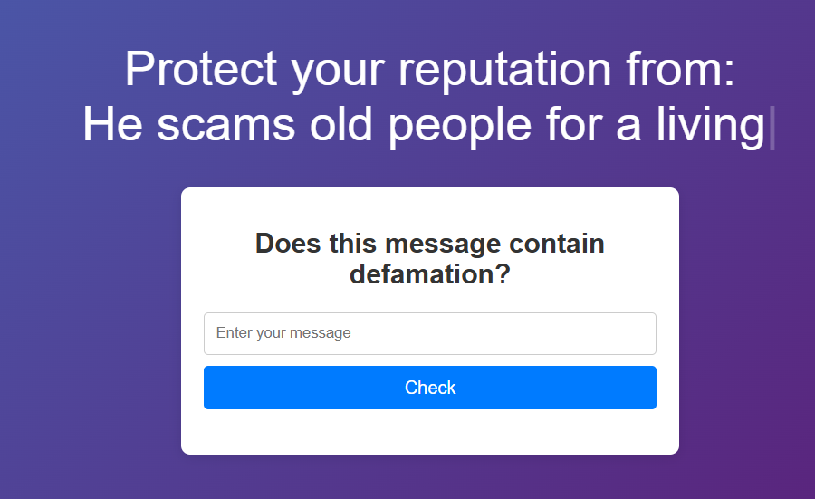

# Defame or Nah
"Defame or Nah" aims to create an innovative online tool that empowers individuals to determine whether a publicly
published message is defamatory or not, providing them with clarity and confidence in their reputation management.



**Problem Statement:**
In today's digital age, publicly published messages can have a significant impact on one's reputation. With the rise
of social media and online content, verifying whether a statement is defamatory has become increasingly challenging.
Existing solutions often rely on manual research or consultation with lawyers, which can be time-consuming and
costly.

**Background:**
Defamation laws can be very complicated, making it essential to develop a platform that can accurately identify
potential defamation cases. Traditional methods of determining defamation, such as reviewing public court sentences
and precedents, are resource-intensive and not easily scalable.

**Stakeholders and Their Needs:**

1. **Individuals**: They need an easy-to-use tool to determine whether a publicly published message is
defamatory or not so they can take legal action if needed
2. **Law Agencies**: They require a reliable platform for investigating defamation cases and gathering
evidence to protect the fame of their client
3. **Celebrities**: They need to protect their reputation from defamation.

**Vision of Solution:**
The "Defame or Nah" platform aims to provide tool that:

1. Allows users to input a publicly published message.
2. Uses web scraping and natural language processing techniques to analyze the message for potential defamation.
3. Cross-references public court sentences and precedents using secondary data analysis to determine the likelihood
of defamation.

**Features:**

1. User-friendly interface for inputting messages.
2. Natural language processing (NLP) algorithms to analyze message sentiment and identify potential defamation.

# Quick start
### Using Docker
```sh
$ docker build -t defameornah .
$ docker run --name defameornah -p 8000:8000 -d defameornah
```
You can now visit via localhost:8000  
### Manually
1. Install Ollama  
2. Pull bge-m3 model using ollama  
3. Clone this repo
4. Create or activate virtual environment (optional)
5. `pip install -r requirements.txt`
6. Generate stub: `fastapi-codegen --input .openapi/api.yml --output ./stub --output-model-type pydantic_v2.BaseModel --template-dir ./templates`
7. Run: `fastapi run main.py`

You can now visit via localhost:8000  